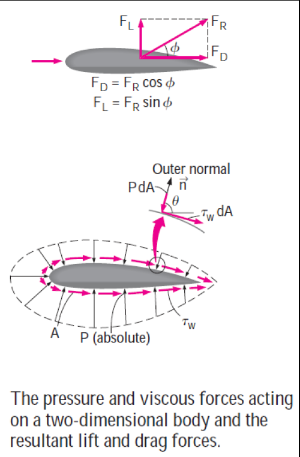
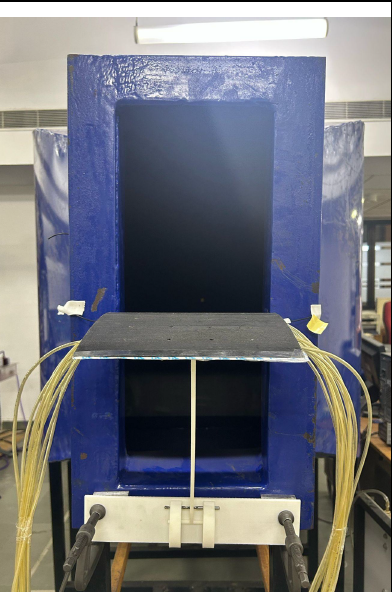
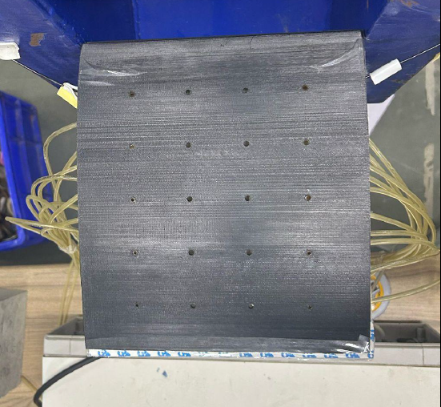
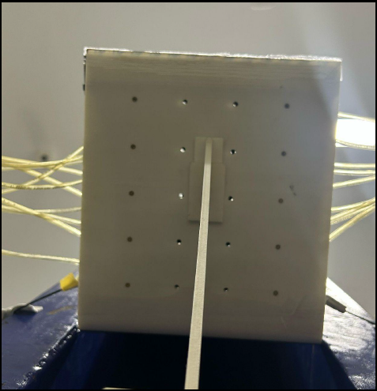
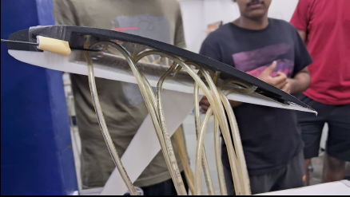
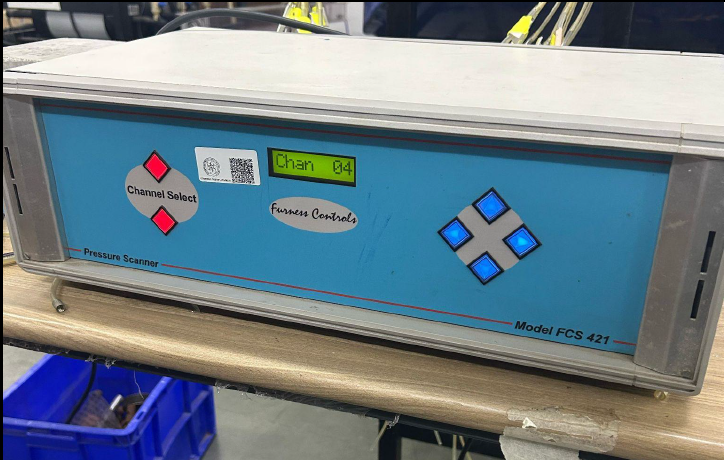
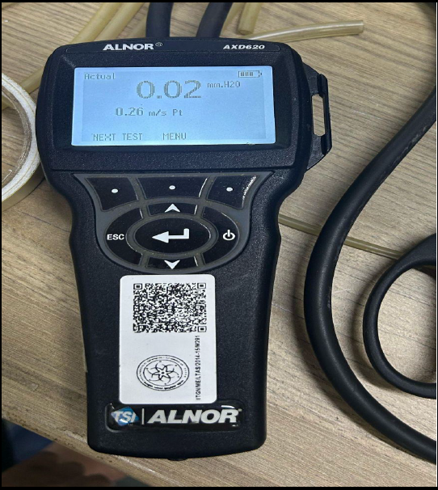

# Lift Measurement for External Flow Over Aircraft Wing

**Course:** ME 207: Fluid Dynamics  
**Institute:** IIT Gandhinagar  
**Team:** Group 7  
- Anuj Manoj Joshi (23110033)  
- Jatin Agarwal (23110147)  
- Tanushka Anand Sonde (23110332)  
- Vardayini Agrawal (23110353)  
- Yug Mitulkumar Desai (23110370)

---

## Objective

This project aims to investigate the lift characteristics of a NACA 4412 airfoil under varying flow conditions. Our key goals were to:

- Measure lift force at different angles of attack and freestream velocities.
- Determine the lift coefficient (Cl) for each condition.
- Compare experimental lift data with theoretical/computational predictions.
- Perform uncertainty analysis on measured parameters (lift, velocity, angle of attack).

---

## Theoretical Background

We explored fundamental aerodynamic concepts such as:

---

### 1. Lift Force & Coefficient

The lift force \(L\) is given by:

$$
L = C_L \,\frac{1}{2}\,\rho V^2 A
$$

**Variables**

| Symbol     | Description                     | Units   |
|------------|---------------------------------|---------|
| $C_L$      | Lift coefficient (dimensionless) | –       |
| $\rho$     | Air density                      | kg/m³   |
| $V$        | Freestream velocity              | m/s     |
| $A$        | Planform area                    | m²      |

---

### 2. Angle of Attack and Thin Airfoil Theory

According to Thin Airfoil Theory:

$$
C_L = 2\pi \alpha \quad \text{(for small angles, in radians)}
$$

This applies to symmetric airfoils in inviscid, incompressible flow.

---

### 3. Reynolds Number

The Reynolds number \( Re \) is a key parameter in predicting flow behavior:

$$
Re = \frac{\rho V L}{\mu}
$$

Where:
- $V$: Velocity (m/s)  
- $L$: Characteristic length (e.g., chord length) (m)  
- $\mu$: Dynamic viscosity (Pa·s)

---

### 4. Pressure Distribution Method for Lift

The elemental lift force due to surface pressure and shear is:

$$
dF_L = -P \sin \theta \, dA + \tau_w \cos \theta \, dA
$$

Total lift over the surface:

$$
F_L = \int_A \left( -P \sin \theta + \tau_w \cos \theta \right) dA
$$

Typically, at low angles of attack and moderate Reynolds numbers, pressure differences dominate lift generation, and shear effects are minimal.

  

---

## Experimental Setup

### Airfoil & Mount
- **Airfoil:** 3D-printed NACA 4412 with 20 pressure taps (10 upper, 10 lower).
- **Mounting:** Custom 3D-printed stand, adjustable angle of attack via rotation.

|  |  |  |
|:--------------------:|:--------------------:|:--------------------:|
| Airfoil Setup            | Pressure tapes from top            | Pressure tapes from bottom            |

### Pressure Measurement System
- **Instruments:** Pressure scanner + digital manometer
- **Tubes:** Carefully labeled and mapped to each tap

|  |  |  |
|:--------------------:|:--------------------:|:--------------------:|
| Pressure tubes            | Pressure scanner           | Digital manometer            |

### Wind Tunnel
- **Type:** Closed-circuit wind tunnel with adjustable fan speed
- **Velocity Measurement:** Pitot-static tube + manometer

### Final Setup & Demo

**Demo Video**  
[Watch the video](Project_video.mp4)

---

## Measurements

- Lift measured at **3 angles of attack** and **3 wind speeds**.
- Gauge pressures recorded at 20 surface taps.
- Velocity determined using Pitot-static data.

See full report: [Lift_Measurement_Report.pdf](./Lift_Measurement_Report.pdf)

---

## Results & Analysis

- Lift coefficient increased with both velocity and angle of attack.
- Cambered airfoil produced lift even at 0° AoA.
- No stall observed at high AoA due to laminar flow conditions and low Re.

---

## Conclusion

The experiment successfully demonstrated how pressure differences create lift. We validated Thin Airfoil Theory in controlled conditions, learned the limits of theory vs. experiment, and gained hands-on experience in fluid dynamics experimentation.

---

## References

- Anderson, J. D. (2017). *Fundamentals of Aerodynamics* (6th ed.)
- Çengel, Y. A., & Cimbala, J. M. (2018). *Fluid Mechanics: Fundamentals and Applications* (4th ed.)
- White, F. M. (2011). *Fluid Mechanics* (7th ed.)

---

## Acknowledgements

We thank **Prof. Dilip Srinivas Sundaram** and **Prof. Uddipta Ghosh**, as well as the TAs for their guidance during the course and lab work.

---
